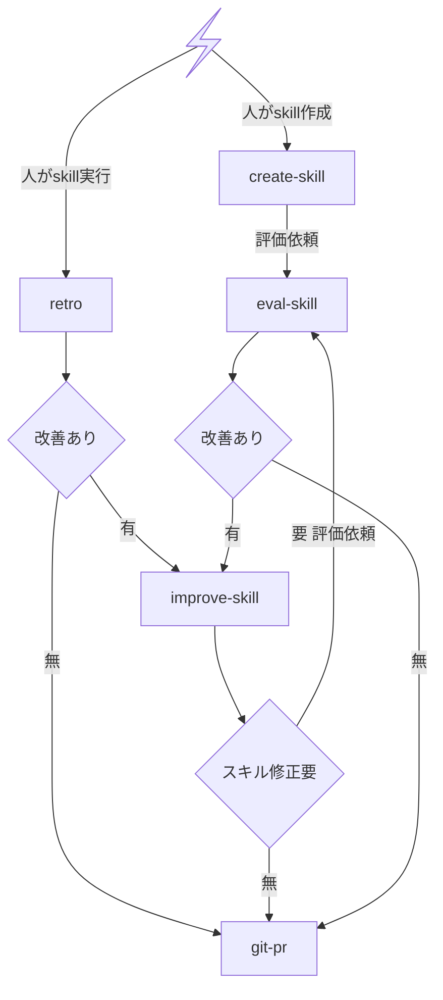
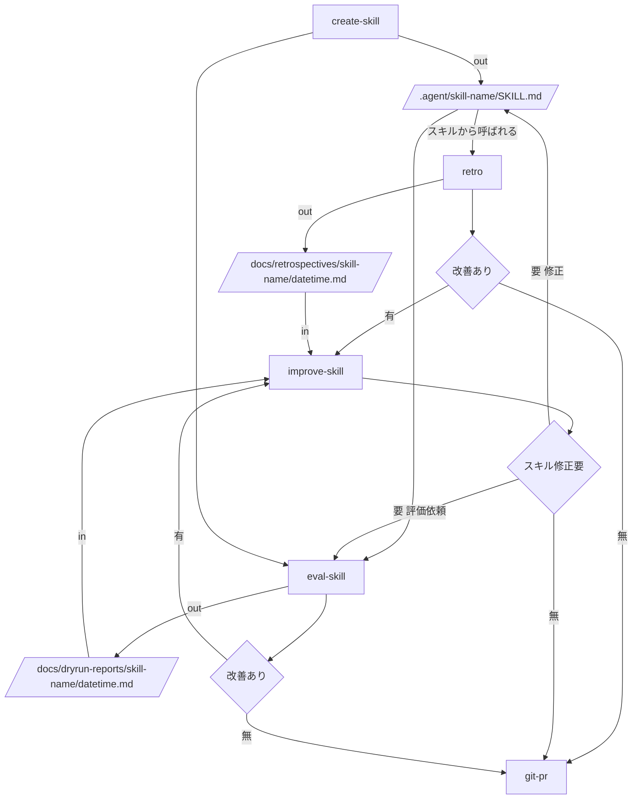

## loop-design

```mermaid

flowchart TB
  create["create-skill"]
  retro["retro"]
  improve["improve-skill"]
  node_1{"改善あり"}
  node_2["eval-skill"]
  node_5["git-pr"]
  node_6{"スキル修正要"}
  node_7{"改善あり"}
  node_3@{shape: bolt}
  retro --> node_1
  node_1 --"有"--> improve
  node_1 --"無"--> node_5
  improve --> node_6
  node_2 --> node_7
  node_7 --"有"--> improve
  node_6 --"無"--> node_5
  node_7 --"無"--> node_5
  node_6 --"要 評価依頼"--> node_2
  create --"評価依頼"--> node_2
  node_3 --"人がskill実行"--> retro
  node_3 --"人がskill作成"--> create

```
## loop-design

```mermaid

flowchart TB
  create["create-skill"]
  skill_file[/".agent/skill-name/SKILL.md"/]
  retro["retro"]
  improve["improve-skill"]
  node_1{"改善あり"}
  node_2["eval-skill"]
  node_3[/"docs/retrospectives/skill-name/datetime.md"/]
  node_4[/"docs/dryrun-reports/skill-name/datetime.md"/]
  node_5["git-pr"]
  node_6{"スキル修正要"}
  node_7{"改善あり"}
  create --"out"--> skill_file
  skill_file --"スキルから呼ばれる"--> retro
  retro --> node_1
  node_1 --"有"--> improve
  skill_file --> node_2
  retro --"out"--> node_3
  node_2 --"out"--> node_4
  node_3 --"in"--> improve
  node_4 --"in"--> improve
  node_1 --"無"--> node_5
  improve --> node_6
  node_2 --> node_7
  node_7 --"有"--> improve
  node_6 --"無"--> node_5
  node_6 --"要 修正"--> skill_file
  node_7 --"無"--> node_5
  node_6 --"要 評価依頼"--> node_2
  create --> node_2

```